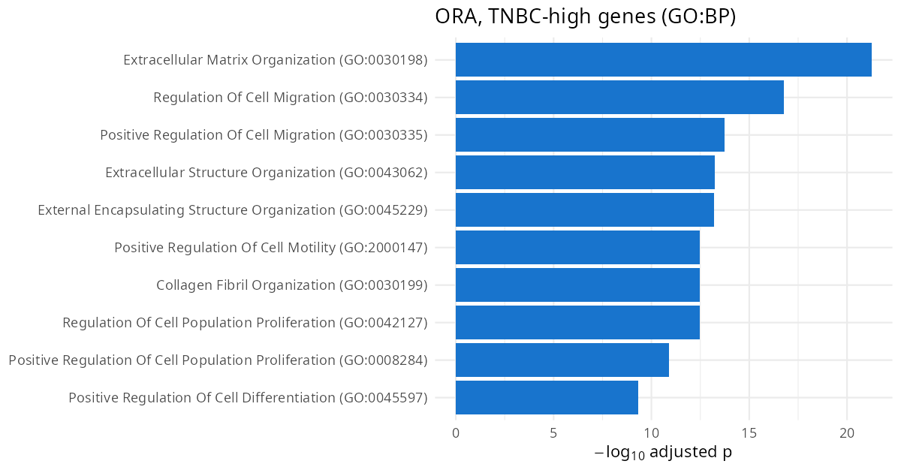
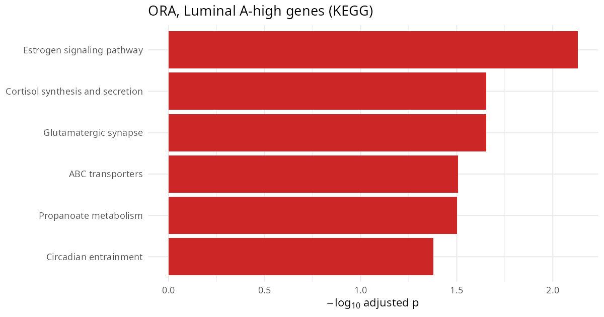
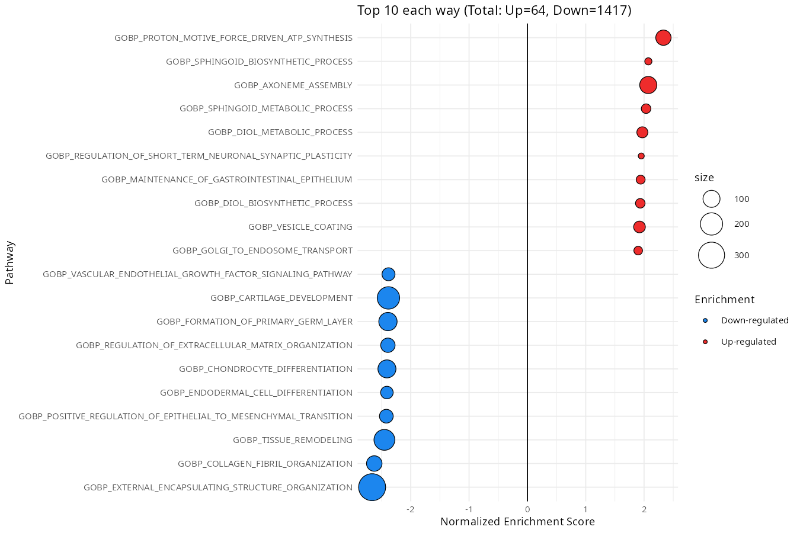
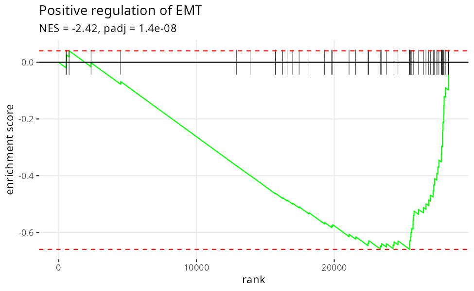
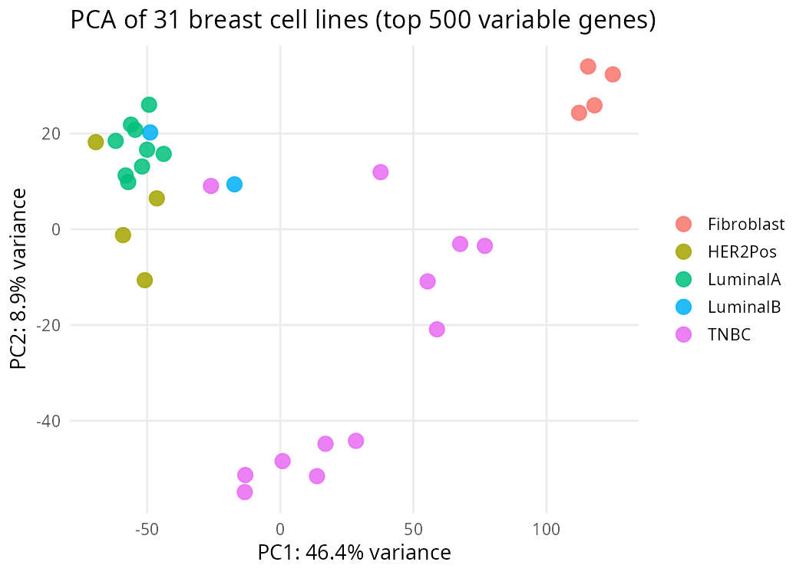

# Functional Genomics Practice: ORA and GSEA in Breast Cancer

This practice focuses on interpreting differential gene expression results using two major approaches:

1. **Over-Representation Analysis (ORA)** — detects enriched biological terms among significantly differentially expressed genes.
2. **Gene Set Enrichment Analysis (GSEA)** — identifies consistent expression trends across ranked gene sets.

We use differentially expressed genes from the comparison of **Luminal A** and **Triple Negative Breast Cancer (TNBC)** subtypes, from previous practice.

---

## ⚠️ Read this first: which direction is "up"?

Every result below depends on this, and it is the single most common source of confusion.

The DE analysis was run as **Luminal A vs TNBC**, with **TNBC as the reference level**. Therefore:

| In the results | Means | Higher in |
|---|---|---|
| `res_signif_up`, positive `log2FoldChange`, positive `stat`, positive `NES` | up-regulated | **Luminal A** |
| `res_signif_down`, negative `log2FoldChange`, negative `stat`, negative `NES` | down-regulated | **TNBC** |

You can always verify the direction yourself instead of trusting a label — check a gene whose biology you already know:

```r
# ESR1 = estrogen receptor. Luminal A is ER-positive by definition, TNBC is ER-negative.
res_raw[res_raw$gene_name == "ESR1", c("log2FoldChange", "padj")]
#   log2FoldChange = +5.22,  padj = 1.4e-09   ->  positive = Luminal A. Confirmed.
```

**Do this check at the start of every enrichment analysis you ever run.** A sign flip turns "TNBC is invasive" into "Luminal A is invasive", and no statistic will warn you.

---

## Setup

The packages come from three different repositories, so they need three different installers:

```r
# CRAN
install.packages(c("enrichR", "dplyr", "msigdbr", "ggplot2", "data.table"))

# Bioconductor — fgsea and DESeq2 are Bioconductor packages, not GitHub packages
if (!requireNamespace("BiocManager", quietly = TRUE)) install.packages("BiocManager")
BiocManager::install(c("fgsea", "DESeq2"))
```

> **Note:** you may see `install_github("ctlab/fgsea")` in older tutorials. That installs the
> development version and can easily give you a build that does not match your Bioconductor
> release. Use `BiocManager::install("fgsea")` unless you specifically need an unreleased feature.

Load the analysis results prepared from the previous practice:

```r
load("func_annotation.RData")
ls()
# "metadata" "norm_counts" "res_raw" "res_signif_down" "res_signif_up"
```

What each object is:

| Object | Contents |
|---|---|
| `res_raw` | DESeq2 results for **all 28,315 tested genes** (needed for GSEA) |
| `res_signif_up` | 631 genes significantly higher in **Luminal A** |
| `res_signif_down` | 1,280 genes significantly higher in **TNBC** |
| `norm_counts` | normalized counts, 18,259 genes × 31 samples (Entrez gene IDs) |
| `metadata` | sample table: cell line name, ER / PR / HER2 status, subtype |

Note that `res_raw` uses **Ensembl** IDs and `norm_counts` uses **Entrez** IDs. Mixing up identifier
systems is the second most common way an enrichment analysis silently returns nothing — you will
see below why the ID type has to match the gene sets you test against.

---

## Over-Representation Analysis (ORA)

ORA asks a simple question: *among my list of significant genes, is any biological term present
more often than you would expect by chance?* It uses a Fisher exact test / hypergeometric test and
treats your gene list as an unordered set — a gene with log2FC = 10 counts exactly the same as one
with log2FC = 1.

```r
library(enrichR)

# Defining gene set databases
dbs <- c("GO_Molecular_Function_2023", "GO_Cellular_Component_2023",
         "GO_Biological_Process_2023", "KEGG_2021_Human")

# Running ORA analysis (this queries the Enrichr web server — internet required)
ora_up   <- enrichr(res_signif_up$gene_name,   databases = dbs)   # Luminal A-high genes
ora_down <- enrichr(res_signif_down$gene_name, databases = dbs)   # TNBC-high genes

# Filtering results by adjusted p value
keep_signif  <- function(x) x[x$Adjusted.P.value < 0.05, ]
ora_up_sig   <- lapply(ora_up,   keep_signif)
ora_down_sig <- lapply(ora_down, keep_signif)

# How many significant terms did each direction give?
data.frame(database  = dbs,
           up_LumA   = sapply(ora_up_sig,   nrow),
           down_TNBC = sapply(ora_down_sig, nrow))
```

```
                    database up_LumA down_TNBC
1 GO_Molecular_Function_2023       3        41
2 GO_Cellular_Component_2023      10        39
3 GO_Biological_Process_2023       0       644
4            KEGG_2021_Human       6        67
```

```r
# Explore one table at a time — View() on the whole list is hard to read
View(ora_down_sig[["GO_Biological_Process_2023"]])
View(ora_up_sig[["KEGG_2021_Human"]])
```

### Results

**TNBC-high genes (`res_signif_down`) — GO Biological Process**

<!-- -->

The top terms are *extracellular matrix organization* (padj = 5.5e-22), *regulation of cell
migration*, *collagen fibril organization*, and *positive regulation of cell motility*. KEGG agrees:
*focal adhesion*, *ECM-receptor interaction*, *PI3K-Akt signaling*, *proteoglycans in cancer*.

**Luminal A-high genes (`res_signif_up`) — KEGG**

<!-- -->

The top term is **estrogen signaling pathway** (padj = 0.0074), driven by `ESR1`, `PGR`, `TFF1`,
`NCOA3`, `RARA`, `BCL2`, `KRT8`, `KRT18`, `CTSD`.

### Why you see these results

**Why the TNBC side lights up with ECM and migration terms.** Luminal A tumours are
well-differentiated epithelial cells: they sit in sheets, hold onto each other through E-cadherin
junctions, and depend on estrogen receptor signalling to proliferate. TNBC lines have lost that
epithelial program and switched on a mesenchymal one. You can see the switch gene by gene:

```r
markers <- c("ESR1","PGR","GATA3","FOXA1","CDH1",   # epithelial / luminal
             "VIM","CDH2","SNAI2","ZEB1","TWIST1")  # mesenchymal
res_raw[match(markers, res_raw$gene_name), c("gene_name","log2FoldChange","padj")]
```

| Gene | log2FC | Higher in | Role |
|---|---|---|---|
| ESR1 | +5.22 | Luminal A | estrogen receptor — the defining luminal driver |
| PGR | +7.92 | Luminal A | progesterone receptor, an ESR1 target gene |
| GATA3 / FOXA1 | +4.5 | Luminal A | pioneer TFs that open chromatin for ESR1 |
| CDH1 | +2.29 | Luminal A | **E**-cadherin, epithelial cell-cell adhesion |
| CDH2 | −5.23 | TNBC | **N**-cadherin, mesenchymal adhesion |
| VIM | −7.69 | TNBC | vimentin, the canonical mesenchymal filament |
| SNAI2 / ZEB1 / TWIST1 | −3 to −7 | TNBC | EMT transcription factors that repress CDH1 |

That CDH1-up / CDH2-down pattern is the textbook **cadherin switch**. The EMT transcription factors
`SNAI2`, `ZEB1` and `TWIST1` directly repress the `CDH1` promoter and activate an ECM and
motility program — which is precisely the set of GO terms ORA hands back. **The enrichment result
is not a separate discovery; it is a summary of a coordinated transcriptional program.** That is the
whole point of functional annotation: turning 1,280 gene names into one sentence.

**Why "collagen" and "extracellular matrix" in a pure cell line experiment?** These are cultured
cells with no stroma and no fibroblasts in the dish. So the collagen genes cannot be contamination
from surrounding tissue — the tumour cells themselves are transcribing `COL4A1`, `COL8A1`, `LOXL2`,
`TGFBI`. Mesenchymal-like cancer cells build and remodel their own matrix, which is mechanistically
how they invade. In a tumour biopsy you would not be able to tell cancer-cell ECM from
fibroblast ECM; here you can.

**Why the Luminal A side looks so much weaker (0 GO:BP terms vs 644).** This is surprising at first,
and the honest answer is that it is a property of the *ontology*, not of the biology:

- GO Biological Process is heavily populated with terms for **migration, adhesion, development, and
  matrix** — processes shared across many mesenchymal cell types and therefore richly annotated.
  There is no equally large, equally well-annotated GO:BP term for "being a differentiated luminal
  breast epithelial cell."
- The luminal signal is real and it *is* detected — just in a database that happens to contain a
  purpose-built term for it. KEGG has an *Estrogen signaling pathway* entry, and it comes out as the
  top hit. GO:MF and GO:CC also return significant terms.
- There are also simply fewer genes on that side (631 vs 1,280), which reduces power.

So the takeaway is **not** "Luminal A has no biology." It is: *absence of enrichment is evidence
about your annotation database, not about your cells.* Always test more than one database before
concluding that a gene list is uninformative.

**Why some hits look biologically absurd.** The Luminal A list also returns *glutamatergic synapse*,
*circadian entrainment* and *melanosome*. Breast cell lines do not form synapses. These terms are
driven by genes that are shared between the pathways — the adenylate cyclases (`ADCY2`, `ADCY5`,
`ADCY6`), calcium channels (`CACNA1D`, `CACNA1H`, `CACNA1I`) and potassium channels. A generic
second-messenger gene belongs to dozens of GO terms, so it inflates all of them at once. When you
see an implausible term, **open the `Genes` column before you believe it**:

```r
ora_up_sig[["KEGG_2021_Human"]][, c("Term", "Adjusted.P.value", "Overlap", "Genes")]
```

If the overlapping genes are all generic signalling machinery, the term is an artefact of pathway
overlap, not a finding.

### The hidden assumption in ORA: the background

ORA compares your gene list to a **background (universe)** of genes. Enrichr uses the whole annotated
genome as background. But our experiment only tested 28,315 genes, and after filtering, both
significant lists contain **only protein-coding genes**:

```r
table(res_signif_up$gene_type)     # protein_coding: 631
table(res_signif_down$gene_type)   # protein_coding: 1280
```

Testing a protein-coding-only list against a whole-genome background inflates significance, because
every GO term is itself protein-coding-biased. Tools such as `clusterProfiler::enrichGO()` let you
pass an explicit `universe =` argument; Enrichr does not. This is a genuine limitation of the
convenient web-based approach, and worth stating in a methods section rather than hiding.

---

## Gene Set Enrichment Analysis (GSEA)

ORA throws away two things: the genes that just missed the significance cutoff, and the magnitude of
the change. GSEA keeps both. It ranks **every** gene, then asks whether the members of a gene set
are clustered at the top or bottom of that ranking rather than scattered through the middle.

The practical consequence: GSEA can detect a pathway where 200 genes each shift a little in the same
direction — a pattern ORA cannot see at all, because none of those genes individually passes
padj < 0.05.

```r
library(fgsea)
library(dplyr)
library(ggplot2)

# defining GSEA function
GSEA <- function(gene_list, GO_file, pval) {
  set.seed(54321)

  myGO = GO_file

  fgRes <- fgsea::fgsea(pathways = myGO,
                        stats = gene_list,
                        minSize=15, ## minimum gene set size
                        maxSize=500, ## maximum gene set size
  ) %>%
    as.data.frame() %>%
    dplyr::filter(padj < !!pval) %>%
    arrange(desc(NES))
  message(paste("Number of significant gene sets =", nrow(fgRes)))

  fgRes$Enrichment = ifelse(fgRes$NES > 0, "Up-regulated", "Down-regulated")
  filtRes = rbind(head(fgRes, n = 10),
                  tail(fgRes, n = 10 ))

  total_up = sum(fgRes$Enrichment == "Up-regulated")
  total_down = sum(fgRes$Enrichment == "Down-regulated")
  header = paste0("Top 10 each way (Total: Up=", total_up,", Down=", total_down, ")")

  colos = setNames(c("firebrick2", "dodgerblue2"),
                   c("Up-regulated", "Down-regulated"))

  g1 = ggplot(filtRes, aes(reorder(pathway, NES), NES)) +
    geom_point( aes(fill = Enrichment, size = size), shape=21) +
    scale_fill_manual(values = colos ) +
    scale_size_continuous(range = c(2,10)) +
    geom_hline(yintercept = 0) +
    coord_flip() +
    labs(x="Pathway", y="Normalized Enrichment Score", title=header) +
    theme_minimal(base_size = 9)

  output = list("Results" = fgRes, "Plot" = g1)
  return(output)
}
```

### Building the ranked list

```r
# Rank ALL genes by the Wald statistic, not by p-value
res_raw <- res_raw[!is.na(res_raw$stat), ]            # fgsea cannot handle NA
res_raw <- res_raw[order(res_raw$stat, decreasing = TRUE), ]
ordered_gene_list <- setNames(res_raw$stat, substr(rownames(res_raw), 1, 15))

length(ordered_gene_list)   # 28315 — the WHOLE list, not just the significant genes
range(ordered_gene_list)    # -16.8 to 22.0
```

Three details in those four lines that you should be able to justify:

- **Why `stat` and not `pvalue`?** GSEA needs a *signed* ranking. A p-value is unsigned — p = 1e-20
  tells you a gene changed a lot but not in which direction, so ranking by it would put the strongest
  Luminal A genes and the strongest TNBC genes next to each other at the same end. DESeq2's `stat` is
  the Wald statistic (log2FC / lfcSE): its **sign gives the direction** and its **magnitude gives the
  confidence**. It is the natural GSEA ranking metric.
- **Why `substr(..., 1, 15)`?** The rownames are versioned Ensembl IDs like `ENSG00000160180.17`.
  MSigDB stores unversioned IDs like `ENSG00000160180`. Without stripping the `.17` suffix, **zero**
  genes would match and every pathway would come back empty. This is the ID-matching trap mentioned
  in the Setup section. Always check the overlap:
  ```r
  length(intersect(names(ordered_gene_list), unique(unlist(pathways))))   # 14846 — good
  ```
- **Why all 28,315 genes?** Feeding GSEA only the significant genes would defeat its purpose and
  double-count the same filtering that ORA already did.

### Loading the gene sets

```r
library(msigdbr)

# msigdbr >= 10.0 renamed the arguments: category -> collection, subcategory -> subcollection
pathwaysDF <- msigdbr(species = "Homo sapiens",
                      collection = "C5", subcollection = "GO:BP")

# split into a named list: pathway name -> vector of Ensembl IDs
pathways <- split(as.character(pathwaysDF$ensembl_gene), pathwaysDF$gs_name)
length(pathways)   # 7538 gene sets
```

> If you use the older `subcategory = "GO:BP"` it still works but emits a deprecation warning.
> Note that `pathways` holds **Ensembl** IDs, which is why the ranked list above had to be Ensembl
> too. If you wanted to rank by gene symbol instead you would `split()` on `gene_symbol`.

### Run GSEA and visualize results

```r
gsea_res <- GSEA(ordered_gene_list, pathways, pval = 0.05)
# Number of significant gene sets = 1481

gsea_res$Plot
```

<!-- -->

Of 3,954 gene sets that passed the size filter, **1,481 are significant: 64 up (Luminal A) and
1,417 down (TNBC)**.

```r
# The strongest TNBC pathways are at the BOTTOM of the table (most negative NES)
tail(gsea_res$Results[, c("pathway", "NES", "padj", "size")], 8)
```

| Pathway | NES | padj |
|---|---|---|
| GOBP_EXTERNAL_ENCAPSULATING_STRUCTURE_ORGANIZATION | −2.66 | 1.4e-26 |
| GOBP_COLLAGEN_FIBRIL_ORGANIZATION | −2.63 | 9.1e-12 |
| GOBP_TISSUE_REMODELING | −2.45 | 3.3e-13 |
| GOBP_POSITIVE_REGULATION_OF_EPITHELIAL_TO_MESENCHYMAL_TRANSITION | −2.42 | 1.4e-08 |
| GOBP_ENDODERMAL_CELL_DIFFERENTIATION | −2.41 | 8.7e-08 |
| GOBP_CHONDROCYTE_DIFFERENTIATION | −2.41 | 1.0e-10 |

### Why you see these results

**Why 1,417 down but only 64 up?** This lopsidedness is the most striking thing on the plot and it
is not a bug. Two causes, both worth understanding:

1. *Biological.* The mesenchymal program in the TNBC lines is enormous and coordinated — hundreds of
   ECM, adhesion, migration and developmental genes moving together. It dominates the entire ranked
   list, so almost any gene set that touches those genes gets pushed to the bottom end.
2. *Statistical.* GO:BP terms overlap heavily. `EXTRACELLULAR_MATRIX_ORGANIZATION`,
   `EXTERNAL_ENCAPSULATING_STRUCTURE_ORGANIZATION` and `COLLAGEN_FIBRIL_ORGANIZATION` share most of
   their genes, so **1,417 significant sets do not mean 1,417 independent findings.** They are
   largely one finding, counted many times.

The fix for (2) is `fgsea::collapsePathways()`, which keeps only the "main" pathway from each set of
redundant ones:

```r
fgRes <- gsea_res$Results
concise <- collapsePathways(data.table::as.data.table(fgRes[order(fgRes$pval), ]),
                            pathways = pathways, stats = ordered_gene_list)
fgRes_collapsed <- fgRes[fgRes$pathway %in% concise$mainPathways, ]
nrow(fgRes_collapsed)
# 337  (down from 1481)
```

**1,481 collapses to 337 — a 77% reduction, and the up/down split becomes 26 / 311.** The top hits
are unchanged (`EXTERNAL_ENCAPSULATING_STRUCTURE_ORGANIZATION`, `COLLAGEN_FIBRIL_ORGANIZATION`,
`POSITIVE_REGULATION_OF_EMT` all survive), which is reassuring: the *biology* was never in doubt,
only the bookkeeping. This is the single best illustration of why a raw "number of significant
pathways" is a near-meaningless statistic to quote. The step takes a few minutes to run.

**Why the up-regulated (Luminal A) pathways look like noise.** *Proton motive force driven ATP
synthesis*, *axoneme assembly*, *sphingoid biosynthetic process* — these are not what you expect for
"luminal breast cancer". Two things are happening. First, only 64 sets are significant on that side,
so you are scraping the bottom of the barrel to fill 10 slots. Second, the differentiated luminal
phenotype is largely *the absence* of the mesenchymal program plus estrogen-driven proliferation, and
GO:BP has no good term for that — the same annotation-coverage problem that produced 0 GO:BP terms
in ORA. **Note that the up-side NES values (~2.0) are still respectable; it is their biological
interpretability, not their statistics, that is weak.** Testing the MSigDB Hallmark collection
(`collection = "H"`), which includes a curated `HALLMARK_ESTROGEN_RESPONSE_EARLY` set, is the
natural next step — see the exercises.

### Reading a single enrichment plot

```r
fgsea::plotEnrichment(pathways[["GOBP_POSITIVE_REGULATION_OF_EPITHELIAL_TO_MESENCHYMAL_TRANSITION"]],
                      ordered_gene_list)
```

<!-- -->

**How to read it.** The x-axis is the position of a gene in the ranked list: rank 1 on the left is
the most Luminal A-shifted gene, rank 28,315 on the right is the most TNBC-shifted. Each black tick
is one of the 57 genes in the EMT set. The green line is the running enrichment score: it steps up at
each tick and drifts down between them.

**What this particular plot shows.** The ticks pile up at the far right and the green curve falls
monotonically to a minimum of −0.66 near rank 25,000. NES = **−2.42**, padj = 1.4e-08.

**The sign trap.** The curve goes *down* and the NES is *negative*, so it is tempting to conclude
"EMT is down-regulated in TNBC" — which is exactly backwards. Negative NES means enriched at the
**bottom** of the ranking, and the bottom of this ranking is **TNBC-high**. So EMT is
**up-regulated in TNBC**, which is what the biology predicts: EMT drives the invasion and metastasis
that make TNBC clinically aggressive. Whenever you read an enrichment plot, say out loud what the
two ends of *your* ranked list mean before you interpret the direction.

---

## PCA Visualization

PCA helps visualize overall sample separation based on gene expression. It is worth doing **before**
you trust any enrichment result: if your groups do not separate, your DE genes are noise.

> **Note:** many tutorials use `DESeq2::plotPCA(vst(dds))`. That needs the `dds` DESeqDataSet object,
> which is **not** saved in `func_annotation.RData` — only the normalized counts are. Running
> `plotPCA(vst(dds, blind = FALSE), ...)` here fails with `object 'dds' not found`. The code below
> does the same thing from `norm_counts`, and has the side benefit of showing you what `plotPCA()`
> actually does internally.

```r
library(ggplot2)

# 1. log-transform to stop the highest-expressed genes from dominating
log_counts <- log2(norm_counts + 1)

# 2. keep the 500 most variable genes — PCA on all 18,259 is mostly noise
gene_var  <- apply(log_counts, 1, var)
top_genes <- order(gene_var, decreasing = TRUE)[1:500]

# 3. PCA on samples (hence the transpose)
pca     <- prcomp(t(log_counts[top_genes, ]))
percent <- round(100 * pca$sdev^2 / sum(pca$sdev^2), 1)

pca_df <- data.frame(PC1 = pca$x[, 1], PC2 = pca$x[, 2],
                     Subtype = metadata$Subtype, Name = metadata$Name)

ggplot(pca_df, aes(PC1, PC2, colour = Subtype)) +
  geom_point(size = 4, alpha = 0.85) +
  labs(title = "PCA of 31 breast cell lines (top 500 variable genes)",
       x = paste0("PC1: ", percent[1], "% variance"),
       y = paste0("PC2: ", percent[2], "% variance")) +
  theme_minimal(base_size = 13) +
  theme(legend.title = element_blank(), panel.grid.minor = element_blank())
```

<!-- -->

### Why you see these results

**PC1 (46.4%) is the same epithelial–mesenchymal axis the enrichment analysis found.** Reading left
to right: Luminal A (mean PC1 = −54) and HER2+ (−56) cluster tightly on the left, TNBC (+25) spreads
across the middle and right, and the **fibroblasts (+118) sit at the far right extreme**. The
fibroblasts are the built-in positive control — they are genuinely mesenchymal cells, and PC1 places
the mesenchymal TNBC lines on the same side as them. The axis that explains nearly half of all
variation in the dataset is the *same* biology that ORA and GSEA reported. Three independent methods
converging on one answer is what a solid result looks like.

**Why is TNBC so spread out while Luminal A is a tight ball?** This is the most instructive feature
of the plot. TNBC is a diagnosis of *exclusion* — ER−, PR−, HER2− — so it is defined by what the
cells lack, not by a shared driver. Luminal A cells all run the same ESR1/GATA3/FOXA1 program, so
they look alike. Check the spread against vimentin:

| Cell line | PC1 | VIM (normalized counts) |
|---|---|---|
| BT549 | +77 | 50,475 |
| MDAMB157 | +68 | 49,451 |
| MDAMB231 | +38 | 37,312 |
| HCC1937 | +1 | 83 |
| MDAMB468 | −13 | 444 |
| DU4475 | −26 | 29 |

The TNBC lines at high PC1 are the **claudin-low / mesenchymal** ones; those at low PC1 are
**basal-like** and still epithelial. PC1 is tracking real biological substructure *inside* TNBC that
the subtype label hides.

**This is also the main caveat of the whole practice.** Our DE analysis pooled all 12 TNBC lines into
one group, and 4–5 of them are strongly mesenchymal. Those lines are largely responsible for the
1,417 down-regulated pathways. In actual TNBC *tumours* the claudin-low phenotype is much rarer
(~10% of TNBC), and long-term culture selects for mesenchymal lines. **The EMT signal here is real
for these cell lines but is exaggerated relative to patient tumours.** Recognising when your model
system amplifies a phenotype is part of interpreting functional annotation honestly — the enrichment
statistics cannot tell you this, only knowing your samples can.

**Why does PC2 (8.9%) split TNBC in two?** The basal-like TNBC lines (HCC1143, HCC1187, HCC1599,
HCC1937, MDAMB468) drop to PC2 ≈ −50 while everything else sits near 0. PC2 is separating basal-like
from claudin-low TNBC — the second axis of a PCA often captures substructure within the group that
PC1 lumps together.

---

## Exercises

1. **Check the direction.** Without looking at the tables above, pick three genes you know are
   estrogen-regulated and three mesenchymal genes, and confirm the sign convention yourself.
2. **Database dependence.** Rerun GSEA with the Hallmark collection
   (`msigdbr(species = "Homo sapiens", collection = "H")`). Does
   `HALLMARK_ESTROGEN_RESPONSE_EARLY` come up positive? Compare how interpretable the top 10 up-
   regulated sets are versus GO:BP, and explain the difference.
3. **ORA vs GSEA.** Take the GO:BP terms significant in ORA-down and the negative-NES terms from
   GSEA, and compute the overlap. Which terms does GSEA find that ORA misses, and why?
4. **Collapse the redundancy.** Run `collapsePathways()` and inspect *which* sets were dropped as
   redundant. Pick one dropped term and its surviving "main" term and explain, from their gene
   overlap, why keeping both would be double-counting.
5. **Threshold sensitivity.** Redo ORA using only genes with `padj < 0.01 & abs(log2FoldChange) > 2`.
   Do the top terms change? What does the answer tell you about how robust the biological conclusion
   is versus how arbitrary the cutoff is?
6. **Split the group.** Redo the DE analysis using only the 5 basal-like (low-PC1) TNBC lines against
   Luminal A. Does the ECM/EMT enrichment survive? This directly tests the caveat raised above.

---

## Reproducing this document

All figures are generated by `run_practice.R` in this directory:

```bash
Rscript run_practice.R
```

It writes `figures/ora_down_tnbc.png`, `figures/ora_up_luminalA.png`, `figures/gsea_plot.png`,
`figures/enrichment_plot.png` and `figures/pca_plot.png`, and prints the summary tables quoted above.
The ORA step queries the Enrichr web server, so it needs an internet connection; the GSEA step takes
1–2 minutes.
